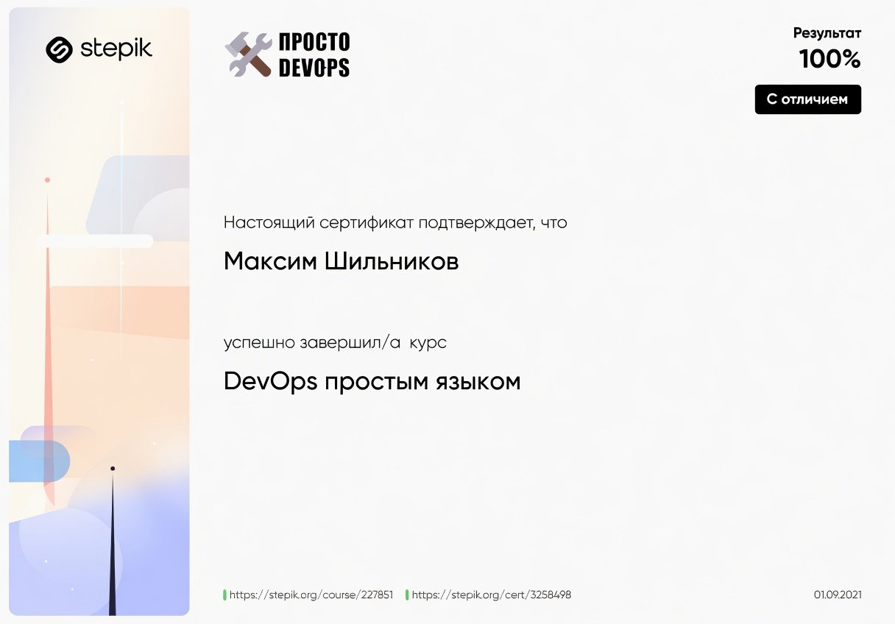
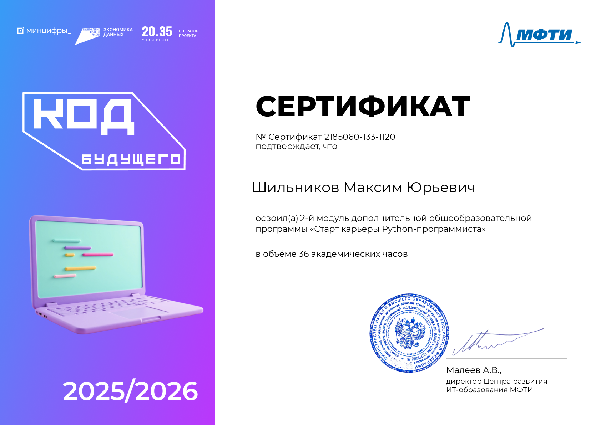
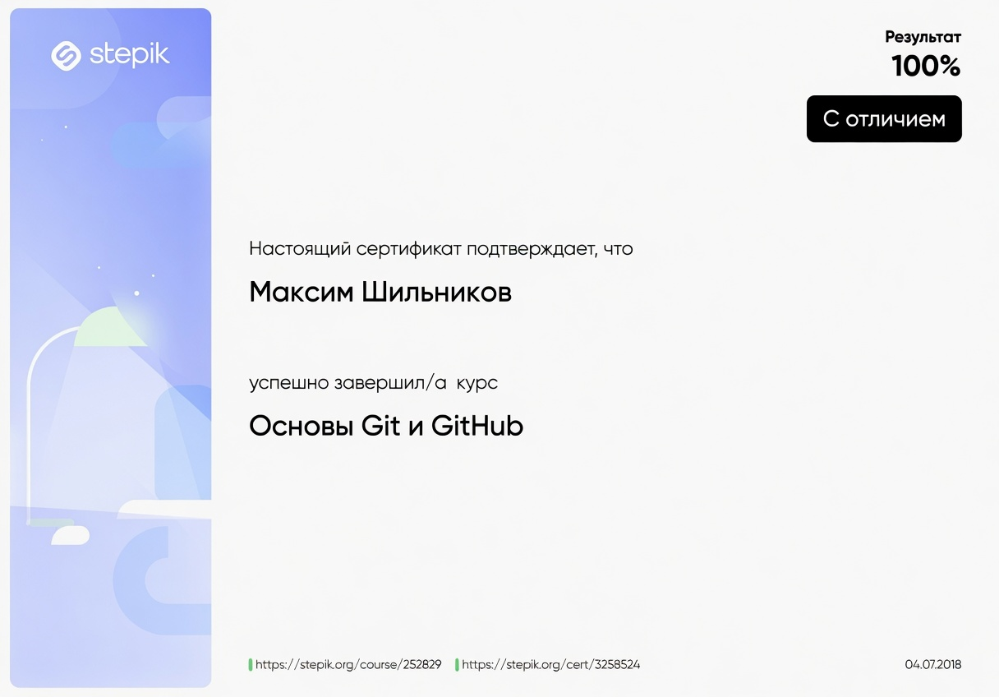
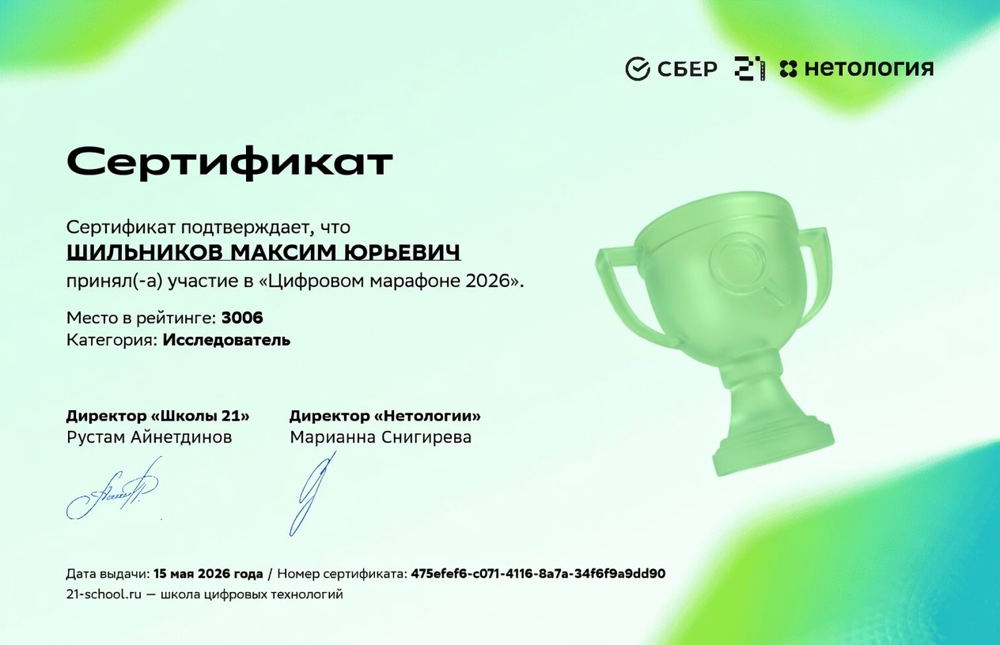

 

  

<h1 align="center">Привет! 👋 Меня зовут Макс</h1>

<h3 align="center">начинающий Python-разработчик</h3>

### 🧑‍💻 Обо мне

Я начинающий Python-разработчик.  
Путь в IT начался с двух курсов на **Stepik**, где я освоил основы программирования.  
Потом прошёл курс **«Код будущего»** от МФТИ — он дал мощный старт и уверенность.  

Сейчас активно учусь самостоятельно: пишу pet-проекты, изучаю лучшие практики, читаю код open-source и готовлюсь к первой работе / стажировке.  
Цель на ближайшие 3–5 лет — уверенный **Middle → Senior Python Developer**.

### 🛠 Технологии, с которыми работаю

  

### 🎯 Что дальше (2026–2027)

- Получить первую работу / стажировку как Junior Python Developer
- Сделать 3–5 качественных pet-проектов в портфолио   
- Дойти до Middle к 19–20 годам  

Открыт к общению, менторству и стажировкам!  😄
Пиши в Telegram / https://t.me/whgds1360 /

### 🔥 Мои ключевые проекты
- **[snake-game](https://github.com/whgds1360/Snake-game)** — 🐍 Современная классическая Змейка на Python (Tkinter). Чистая модульная архитектура, логирование, отдельные сцены, менеджер ресурсов, конфиг через Pydantic и сборка в standalone .exe через Nuitka. + Docker image

  

- **[vk_to_tg_bot](https://github.com/whgds1360/vk_to_tg_bot)** — 📨 VK to TG Bot — 🚀 Асинхронный бот для пересылки сообщений из ВКонтакте в Telegram. Быстрый старт, легко настраивается. Работает через Long Poll API. Всё просто: создал сообщество, получил токены, указал ID — запустил. 🤖 
 

### 📚 Учебный репозиторий по C#
У меня есть отдельный **учебный репозиторий** — **[practise_on_c#](https://github.com/whgds1360/practise_on_c-)**  

В нём я выполняю лабораторные работы по **Windows Forms** и уже сделал **четыре полноценных проекта**:

- **Чистый WinForms** — классическое приложение только на стандартных компонентах .NET (без сторонних библиотек)
- **WinForms + Guna 2 Framework** — современное приложение с красивым UI, анимациями и кастомными контролами
    

        
    
  
- **Калькулятор WinForms + Guna 2** — удобный калькулятор с стильным интерфейсом на Guna UI 2
    

        
    

- **Приложение погода WinForms + Guna 2 Framework** 
   Приложение погоды работающий на HttpClient с OpenMeteo api
   Использован фреймворк **Guna UI 2** (анимации, кастомные кнопки, панели, графики, темы и т.д.).
   

    
   

- **Приложение для авторизации + Guna 2 Framework** 
   Приложение погоды работающий на драйвере Npgsql и СУБД PostgreSQL
   Использован фреймворк **Guna UI 2** (анимации, кастомные кнопки, панели, графики, темы и т.д.).
   

    
   

Репозиторий постоянно пополняется новыми лабами (МДК). Открывай `.sln` файлы в Visual Studio и пробуй!

## 📜 Мои сертификаты

|                                    |                                                       |
|:----------------------------------:|:-----------------------------------------------------:|
|        |                            |
| **DevOps-инженер** Stepik, 2021 |            **Код будущего**  МФТИ, 2025            |
|         |                            |
|   **Код будущего** МФТИ, 2025   |            **Код будущего**  МФТИ, 2025            |
|              |                       |
|   **Основы Git** Stepik, 2018   | **Цифровой марафон**   Школа 21 от сбербанка, 2026 |

### 🌐 Соцсети

 
 
 

### Открыт к общению, менторству и стажировкам! 😄 Пиши в Telegram

 

  

