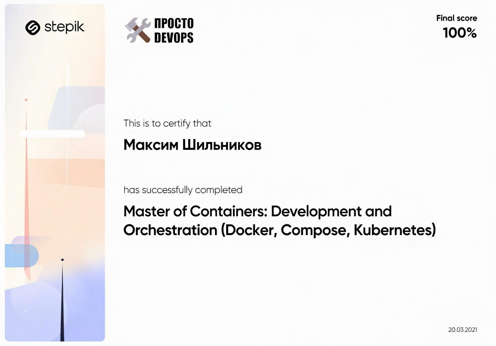
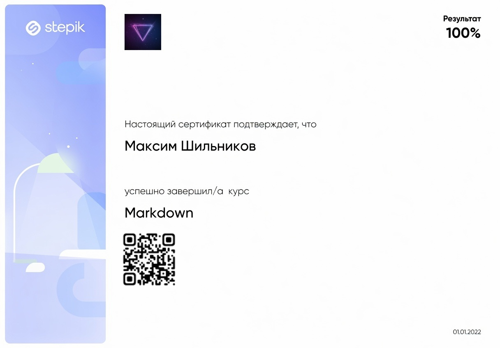

 

  

<h1 align="center">Привет! 👋 Меня зовут Макс</h1>

<h3 align="center">начинающий Python-разработчик</h3>

### 🧑‍💻 Обо мне

Путь в IT начался с двух курсов на **Stepik**, где я освоил основы программирования.
Сейчас активно учусь самостоятельно: пишу pet-проекты, изучаю лучшие практики, читаю код open-source и готовлюсь к первой работе / стажировке.

### 🔥 Мои ключевые проекты
- **[snake-game](https://github.com/whgds1360/Snake-game)** — 🐍 Современная классическая Змейка на Python (Tkinter). Чистая модульная архитектура, логирование, отдельные сцены, менеджер ресурсов, конфиг через Pydantic и сборка в standalone .exe через Nuitka. + Docker image

  

- **[rec-monitor](https://github.com/whgds1360/rec-monitor)** — 🎮 Rec Monitor — лёгкий оверлей для Windows, который показывает загрузку, температуру и частоту ЦП, ОЗУ и видеокарты поверх игр и приложений в реальном времени. Не нагружает систему, работает в фоновом режиме. Написан на C# / Windows Forms.

  

- **[trifusecore-tg-bot](https://github.com/whgds1360/trifusecore-tg-bot)** — ⚙️Telegram-бот с AI, VK-мониторингом, временной почтой и генерацией картинок. Vertical Slice Architecture, Docker-ready. 
 

### 📚 Учебный репозиторий по C#
У меня есть отдельный **учебный репозиторий** — **[practise-on-sharp#](https://github.com/whgds1360/practise_on_c-)**  

В нём я выполняю лабораторные работы по **Windows Forms** и уже сделал **четыре полноценных проекта**:

- **Чистый WinForms** — классическое приложение только на стандартных компонентах .NET (без сторонних библиотек)
- **WinForms + Guna 2 Framework** — современное приложение с красивым UI, анимациями и кастомными контролами
    

        
    
  
- **Калькулятор WinForms + Guna 2** — удобный калькулятор с стильным интерфейсом на Guna UI 2
    

        
    

- **Приложение погода WinForms + Guna 2 Framework** 
   Приложение погоды работающий на HttpClient с OpenMeteo api
   Использован фреймворк **Guna UI 2** (анимации, кастомные кнопки, панели, графики, темы и т.д.).
   

    
   

- **Приложение для авторизации + Guna 2 Framework** 
   Приложение для авторизации работающее на драйвере Npgsql и СУБД PostgreSQL
   Использован фреймворк **Guna UI 2** (анимации, кастомные кнопки, панели, графики, темы и т.д.).
   

    
   

## 📜 Мои сертификаты

|                                                                        |                                                                        |
|:----------------------------------------------------------------------:|:----------------------------------------------------------------------:|
|                                            |                                            |
|          **DevOps-инженер** Stepik, 2021                            |                  **Контейнеризация**  Stepik, 2021                  |
|                                        |                                      |
|             **Markdown** Stepik, 2022                               | **Старт карьеры Python-программиста**  Код будущего МФТИ, 2025-2026 |
|                                                  |                                        |
|            **Основы Git** Stepik, 2018                              |         **Цифровой марафон**   Школа 21 от сбербанка, 2026          |

### 🌐 Соцсети

 
 

### Открыт к общению, менторству и стажировкам! 🌐 Пиши в Telegram

 

  

